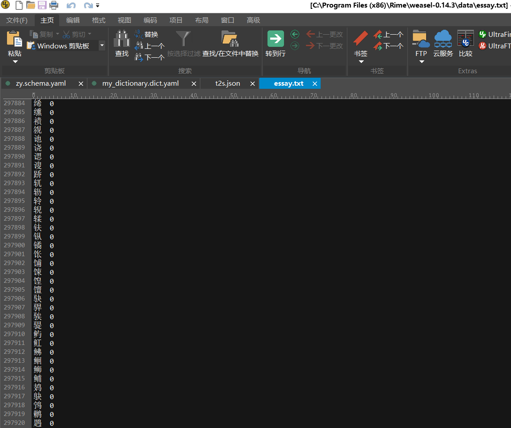
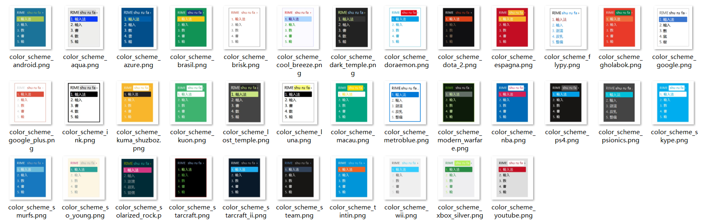
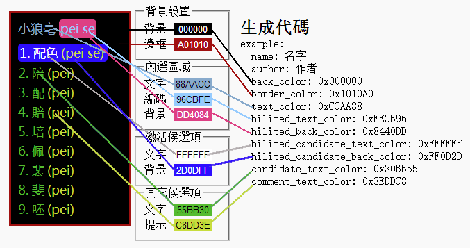
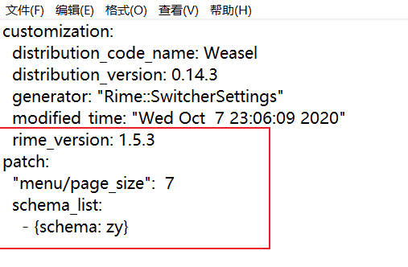
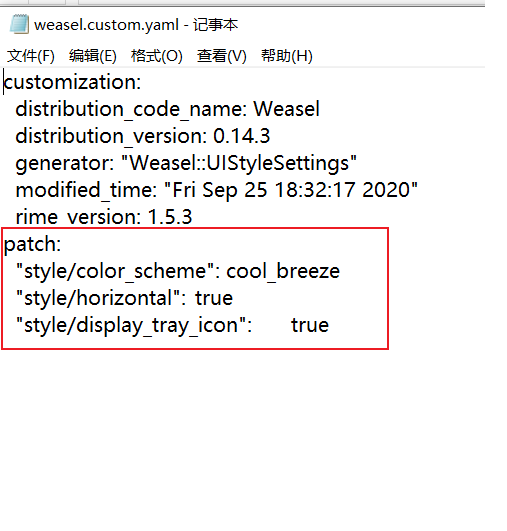
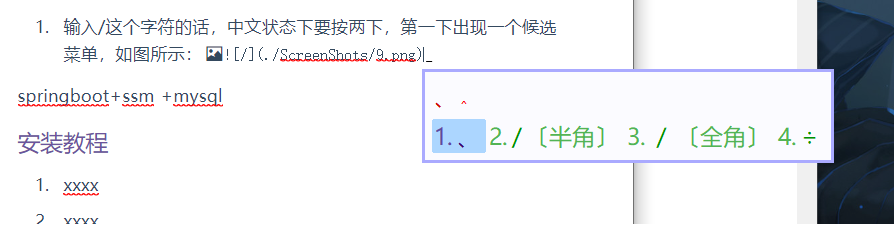
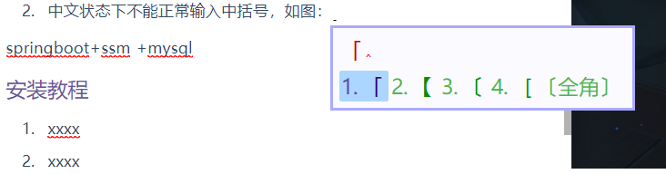
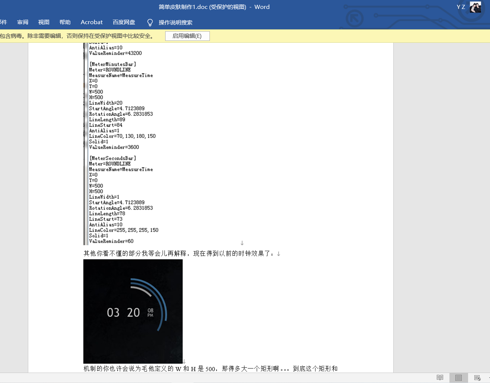

# rime_custom

#### 介绍

em,我一开始是用搜狗输入法，但是对电脑了解的慢慢多了一点之后，觉得搜狗简直就是一个流氓软件，弹窗士可忍孰不可忍，~~很难关掉（个人水平有限）~~。同时不想下载小众网站上去掉广告的安装包……所以一直在寻找电脑上替代搜狗输入法的软件。

1. 微软输入法

   没有什么说的，挺好用的……不过不太喜欢用……

2. `QQ`输入法

   弹窗比搜狗输入法更容易关，也关的彻底，~~不符合搜狗的输入习惯，用着别扭，同时反应比搜狗输入法慢一点……~~

3. [`rime`输入法](https://rime.im/)

   - 缺点：在某些软件里面调不出候选菜单，打字没有上屏的时候输入的所有东西都是看不见的，简单来说就是输入了什么只能靠记忆，要盲选。至于有哪些软件……例如`LOL`；没有字库，或者说字库很少，虽然给了29W字库（包含短语，成语……）,但是……基本上打个词语能出来的都不多，更别说句子了……就是打字听慢的，基本只能打很简单的词语。

     

     

   - 优点：反应快（也不是特别快，大概和QQ输入法、微软输入法差不多的亚子，大概比微软慢一点……）；**能自己定制，大体来说就是可以定制皮肤，定制输入输出按键，输入方式……**

     预置的皮肤有这些：

     不满意还可以自己制作，放一张官方给出的图：

     可以自己定制输入输出方案，大体就是按键动作到最终文字上屏的过程……作者和开发人员已经给写好了，用户需要做的大体就是读懂了给出的各种功能接口（在`rime`中是按照作者给出的`yaml`字段来对输入法进行控制，然后通过软件的”部署“选项进行编译和生成……）

     也可以导出自己的词库，或者导入第三方的词库（比如这次为了提升使用体验，终于下定决心读了一遍开发文档粗略的~~做了~~

     (修改)一个输入法，导入了搜狗的一些词库，不过导入的词库有的比较老，有的还算是比较新，大体能满足日常需求）。主要导入了以下词库：(直接从[搜狗官网](https://pinyin.sogou.com/dict/)下载的,导入第三方词库的过程参见[https://www.jianshu.com/p/300bbe1602d4])

大体来说，折腾了这一顿总算达到了正常使用（词语基本全能出来）（也就是词库足够多）的目的，反应速度也比较快，……总体来说还可以，做完了以后打字打了一晚上没出什么问题……挺舒服的……

#### 软件目录

用到的所有东西都放在了`resources`目录下，不管有用的~~没用的~~

安装完输入法后，右键底部右边菜单栏图标，点击“用户文件夹”，就能打开用户文件夹，一开始里面是比较少的，基本没什么东西。

**如果没有更改安装位置的话，默认是在`C:\Users\35326\AppData\Roaming\Rime`路径下**，然后放入

> 1. `zy.schema.yaml`，这个是输入法的设定，放入这个后重新部署，会在切换输入法的时候多出来一个叫`zy`的输入法
> 2. `my_dictionary.dict.yaml`，这个文件就是字库，把搜狗字库转换后的东西放在了这个文件里，同时这个里面也引用了自带的一个基本的字库和那个29W的字库。
> 3. 将本来就有的`default.custom.yaml`修改一下（如果没有这个文件，自己先更改以下输入设定就有了），如下图所示：，画红圈的地方是需要新增的，**从patch这一行开始**……
> 4. 将本来就有的`weasel.custom.yaml`文件修改一下，如果没有该文件同上。如下图所示：新增的这三行的意思是：皮肤设置成cool_breeze,候选字横排（默认竖排），任务栏显示输入法图标

做完以上几步重新部署即可……

该输入法优点是反应快，词库全部存在本地，能满足正常需求，可以动态改变词频，更换电脑可以通过手动拷贝的方式同步资料（输入法设定和词库）

缺点是词库相对搜狗或者QQ来说还是少一些，不过比微软强；有的软件里面调不出输入法显示（仅仅不能显示）；

……终于找到了一个能替代搜狗的输入法了……

初级使用教程可以参照官网给出的初级指南和这篇知乎文章：[rime定制指南 - 纸糊小透明的文章 - 知乎 https://zhuanlan.zhihu.com/p/91129641]

因为这个输入法都需要参考资料从头开始做，所以缺点还是很多的，比如：

1. 输入/这个字符的话，中文状态下要按两下，第一下出现一个候选菜单，如图所示:，这个其实可以改，只需要改一下映射就可以，不过觉得切换到英文再输入这个符号也不费劲，没有必要改……
2. 中文状态下不能正常输入中括号，如图：，同样能改，但没必要…… 
3. 中英文切换大体和其他输入法一样（其实就提到的其他三种输入法，中英文混合输入也有差异），但是也有一些不方便（不同）的地方，需要细细体会……不过能满足正常使用……这篇文章就是这个定制输入法的第一个实验品，打字还打的挺快的哈哈哈

~~目前可以简繁切换~~

#### 最后

如果有人打算用的话可以试试~~或者直接提issues/pull request~~……发现问题继续改进哈哈哈

下一个要旰的软件是rainmeter,找到了一篇不错的教程……有时间再旰……

教程大概长这样

做出来的效果大体这样：

大体功能主要有：

1. 系统检测：CPU 内存 网速 交换空间 CPU温度等检测
2. 天气预报：结合第三方
3. 时间日期显示
4. 桌面美化
5. 音乐频谱与音乐控制，歌词显示
6. 应用快捷启动

其实这两个软件很像，都是作者写好了框架，然后用户使用作者给出的`ini文件标记`（雨滴美化）或者`yaml标记`（rime输入法）去控制具体的效果，同时都有自己的社区……
