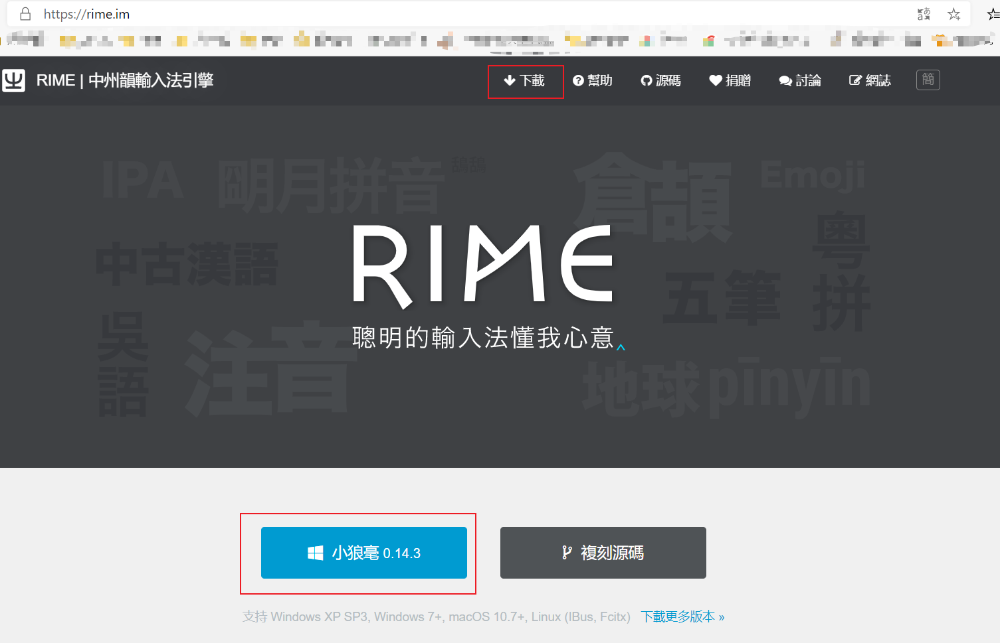
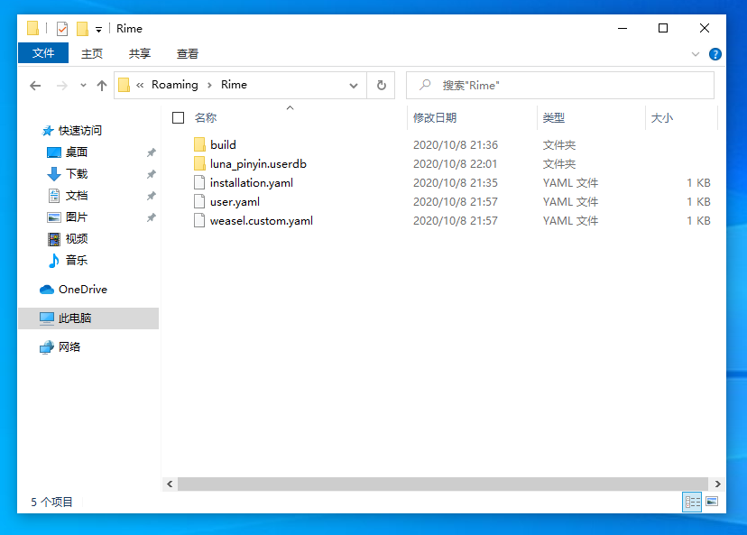
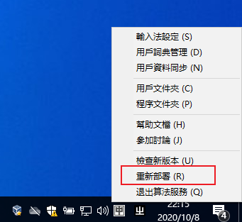
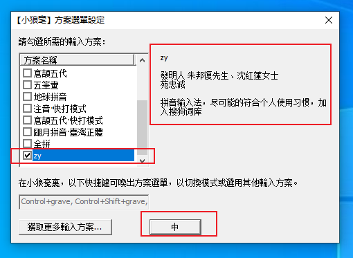
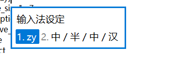
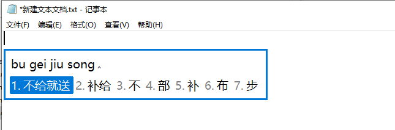
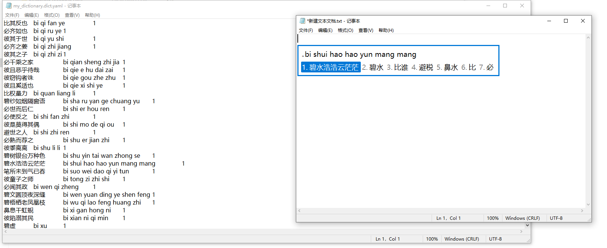
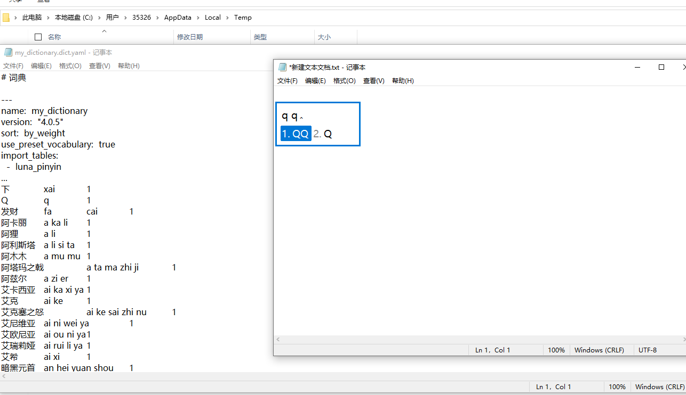

# rime_custom

#### 关于rime输入法（小狼毫输入法）

rime输入法是一款优秀的、跨平台、开源、可高度定制、无任何广告、速度快、所有用户数据都储存在本地 的输入法，支持`Windows`,`macOS`,`Linux`,`Android`平台。

自然也会有一些缺点，比如简单自定义和使用比较简单，深度定制的门槛比较高。

本项目简单定制了一款简体中文（繁体中文）输入法，引入了50W词库，基本能够满足日常使用。

#### 最简使用教程

1. 去rime官网(https://rime.io)下载自己平台下的安装包并安装。过程如下：

   

   

   

   

   

   

2. 将本项目`resources` 文件夹下的4个后缀名是`.yaml`的文件放到程序的“用户文件夹”内。

   **（鉴于国内访问github网站过慢，提供一个百度网盘链接：链接：https://pan.baidu.com/s/1bp3kKyPPCmw5E4An0q-1gw 
   提取码：i0lg 
   复制这段内容后打开百度网盘手机App，操作更方便哦）**

   “程序文件夹”默认是`%AppData%\Roming\Rime`文件夹，（如果安装的时候没有更改任何安装位置设定），该文件夹如果找不到，右键小狼毫输入法图标，选择用户文件夹确认即可打开。  初始时，该文件夹下只有下面几个东西：

   放入4个文件后，右键任务栏小狼毫图标，选择“重新部署”

   

   几秒钟部署成功，然后再右键图标，选择“输入法设定“，取消勾选自带的所有输入法，选中新出现的名字叫"zy"的输入法，点击”中“。

   

   至此完成所有的定制设置，可以使用该输入法打字了。

#### 使用效果

---

至于更详细的说明，请见[README.old.md](./README.old.md)文件说明。