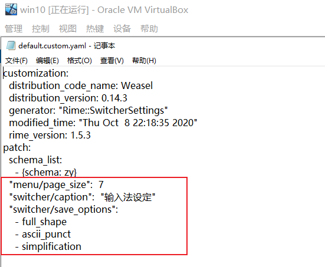

# rime_custom

#### 介绍

~~如果该README文件中图片无法正常显示，可见[pdf文档](./README.pdf)~~

em,我一开始是用搜狗输入法，但是对电脑了解的慢慢多了一点之后，觉得搜狗简直就是一个流氓软件，弹窗孰可忍孰不可忍，~~很难关掉（个人水平有限）~~。同时不想下载小众网站上去掉广告的安装包……所以一直在寻找电脑上替代漱过输入法的软件。

1. 微软输入法

   没有什么说的，挺好用的……不过不太喜欢用……

2. `QQ`输入法

   弹窗比搜狗输入法更容易关，也关的彻底，~~不符合搜狗的输入习惯，用着别扭，同时反应比搜狗输入法慢一点……~~

3. [`rime`输入法](https://rime.im/)

   - 缺点：在某些软件里面调不出候选菜单，打字没有上屏的时候输入的所有东西都是看不见的，也没有候选菜单，简单来说就是输入了什么只能靠记忆，而且没有候选菜单，所以要盲选。至于有哪些软件……例如`LOL`；没有字库，或者说字库很少，虽然给了29W字库（包含短语，成语……）,但是……基本上打个词语能出来的都不多，更别说句子了……就是打字听慢的，基本只能打很简单的词语。

     

     

   - 优点：反应快（也不是特别快，大概和QQ输入法、微软输入法差不多的亚子，大概比微软慢一点……）；**能自己定制，大体来说就是可以定制皮肤，定制输入输出按键，输入方式……**

     预置的皮肤有这些：

     不满意还可以自己制作，放一张官方给出的图：

     可以自己定制输入输出方案，大体就是按键动作到最终文字上屏的过程……作者和开发人员已经给写好了，用户需要做的大体就是读懂了给出的各种功能接口（在`rime`中是按照作者给出的`yaml`字段来对输入法进行控制，然后通过软件的”部署“选项进行编译和生成……）

     也可以导出自己的词库，或者导入第三方的词库（比如这次为了提升使用体验，终于下定决心读了一遍开发文档粗略的~~做了~~(修改了)一个输入法，导入了搜狗的一些词库，不过导入的词库有的比较老，有的还算是比较新，大体能满足日常需求）。主要导入了以下词库：(直接从[搜狗官网](https://pinyin.sogou.com/dict/)下载的,导入第三方词库的过程参见[https://www.jianshu.com/p/300bbe1602d4])


大体来说，折腾了这一顿总算达到了正常使用（词语基本全能出来）（也就是词库足够多）的目的，反应速度也比较快，……总体来说还可以，做完了以后打字打了一晚上没出什么问题……挺舒服的……

#### 软件目录

用到的所有东西都放在了`resources`目录下，不管有用的~~没用的~~

安装完输入法后，右键底部右边菜单栏图标，点击“用户文件夹”，就能打开用户文件夹，一开始里面是比较少的，基本没什么东西。

%AppData%\Roaming\Rime`路径下**，然后放入

> 1. `zy.schema.yaml`，这个是输入法的设定，放入这个后重新部署，会在切换输入法的时候多出来一个叫`zy`的输入法
> 2. `my_dictionary.dict.yaml`，这个文件就是字库，把搜狗字库转换后的东西放在了这个文件里，同时这个里面也引用了自带的一个基本的字库和那个29W的字库。
> 3. 将本来就有的`default.custom.yaml`修改一下（如果没有这个文件，自己先更改以下输入设定就有了），如下图所示：，画红圈的地方是需要新增的，**从patch这一行开始**……
> 4. 将本来就有的`weasel.custom.yaml`文件修改一下，如果没有该文件同上。如下图所示：新增的这三行的意思是：皮肤设置成cool_breeze,候选字横排（默认竖排），任务栏显示输入法图标

做完以上几步重新部署即可……

该输入法优点是反应快，词库全部存在本地，能满足正常需求，可以动态改变词频，更换电脑可以通过手动拷贝的方式同步资料（输入法设定和词库）

缺点是词库相对搜狗或者QQ来说还是少一些，不过比微软强；有的软件里面调不出输入法显示（仅仅不能显示）；

……终于找到了一个能替代搜狗的输入法了……

初级使用教程可以参照官网给出的初级指南和这篇知乎文章：[rime定制指南 - 纸糊小透明的文章 - 知乎 https://zhuanlan.zhihu.com/p/91129641]

因为这个输入法都需要参考资料从头开始做，所以缺点还是很多的，比如：

1. 输入/这个字符的话，中文状态下要按两下，第一下出现一个候选菜单，如图所示:，这个其实可以改，只需要改一下映射就可以，不过觉得切换到英文再输入这个符号也不费劲，没有必要改……
2. 中文状态下不能正常输入中括号，如图：，同样能改，但没必要…… 
3. 中英文切换大体和其他输入法一样（其实就提到的其他三种输入法，中英文混合输入也有差异），但是也有一些不方便（不同）的地方，需要细细体会……不过能满足正常使用……这篇文章就是这个定制输入法的第一个实验品，打字还打的挺快的哈哈哈

~~目前可以简繁切换~~

#### 最后

如果有人打算用的话可以试试~~或者直接提issues/pull request~~……发现问题继续改进哈哈哈

下一个要旰的软件是rainmeter,找到了一篇不错的教程……有时间再旰……

教程大概长这样

做出来的效果大体这样：

大体功能主要有：

1. 系统检测：CPU 内存 网速 交换空间 CPU温度等检测
2. 天气预报：结合第三方
3. 时间日期显示
4. 桌面美化
5. 音乐频谱与音乐控制，歌词显示
6. 应用快捷启动

其实这两个软件很像，都是作者写好了框架，然后用户使用作者给出的`ini文件标记`（雨滴美化）或者`yaml标记`（rime输入法）去控制具体的效果，同时都有自己的社区……

---

#### 2020.10.8更新 加入使用说明

其实本来是不想写使用说明的，结合上面提到的知乎推文（使用指南）+`rime`官网给出的初级定制指南完全够用了。

本意这个东西就不是给电脑小白用的，~~可是有对电脑了解比较少的朋友想支持一下~~想来想去还是写一篇说明吧……

###### 使用说明

1. **从rime官网[https://rime.io]下载安装包**，先进入官网，长这样：

   .画圈的两个地方，随便点进去,进入下载界面：。

   如果是在官网主页点的下面的小狼毫标志，那么是自动下载的。如果是点的上面的下载标志，才会进入自己选择安装包的这个界面。

2.  安装

   傻瓜式安装，记住最重要的一点，一点要闭着眼一路“确定”点下去！

   安装过程依次如下：

   

   

   

   

   

3. 现在已经安装完毕了，切换到刚刚安装成功的小狼毫输入法，就可以使用自带的输入法打字了。

   

   

   默认效果：竖排，候选字个数5，有一个默认皮肤，shift切换中英文输入，大写键可以使用，繁体输入。

   按ctrl+~(tab键上面的那个键，LOL中只以英雄为攻击目标那个键)，可以调出输入法选择界面，如下图：*右键任务栏小狼毫图标，选择输入法设定也可以调出该菜单，如图2所示*

   

   ---

   图2:

   

   

   “中” 代表 “确定”的意思

4. 自带的都比较难用，其中明月拼音和明月简化字两个输入法可以勉强达到使用的要求……

5. 接下来开始自定义输入法

   1. 将`zy.schema.yaml`放到`%AppData%\Roming\Rime`文件夹下，该文件夹如果找不到，右键小狼毫输入法图标，选择用户文件夹确认即可打开。

      初始时，该文件夹下只有下面几个东西：

      放入刚才说的文件，如下：

      

      该文件的所有代码如下所示，基本每一行代码都跟着注释，如果不关心可以直接跳过这一段说明……

      ```yaml
      # 拼音输入法
      
      schema:
        schema_id:  zy # 代码中的内部名称
        name:  zy # 方案的展示名称
        author:  
          -  "發明人 朱邦復先生、沈紅蓮女士"
          -  "苑忠诚"
        version:  "4.0.106"
        description:
          拼音输入法，尽可能的符合个人使用习惯，加入搜狗词库
        
      switches:
        -  name:  ascii_mode # 中英文切换开关
           reset:  0
           states:  [  中文,英文  ]
        -  name:  full_shape # 全角半角切换开关
           reset:  0
           states:  [  半角,全角  ]
        -  name:  ascii_punct # 中西文切换开关
           reset:  0
           states:  [  中文标点,英文标点  ]
        -  name:  simplification
           reset:  1
           states:  [  漢字,汉字  ]
           
      engine:
        processors:
          # 1.2版本加入的-  fluid_editor # 将字符按键记入输入上下文，将输入法连缀成一串
          -  ascii_composer # 处理英文模式及中英文切换
          -  recognizer  #  与 matcher 搭配，处理符合特定规则的输入码，如网址、反查等
          -  key_binder  # 在特定条件下将按键绑定到其他按键，如重定义逗号、句号为候选翻页键
          -  speller # 1.3版本加入 把字母追加到编码串
          -  punctuator # 处理符号按键
          -  selector # 1.5版本加入 选字和换页功能
          -  navigator # 移动插入点
          -  express_editor # 1.3版本加入 空格确认当前输入，其他字符直接上屏
        segmentors:
          -  ascii_segmentor
          -  matcher
          -  abc_segmentor # 1.4版本加入 标记输入码的类型
          -  punct_segmentor # 割界，与前后方的其他编码区分开
          -  fallback_segmentor  # 1.2版本加入的
        translators:
          -  echo_translator # 没有其他结果时，创建一个与编码串一样的候选项
          -  punct_translator # 转换标点符号
          -  script_translator # 脚本表转换
         # -  reverse_lookup_translator # 反查翻译器？不知道有锤子用
        filters:
          -  simplifier # 简繁转换
          -  uniquifier # 过滤重复的候选字，有可能来自简繁转换
          
      translator:
        dictionary:  my_dictionary # 设定table_translator使用的词典名
        enable_encoder:  true # 开启自动造词
        enable_completion:  true # 提前显示尚未输入完整码的字
        enable_sentence:  true # 是否开启自动造句
        enable_user_dict:  true # 开启用户词典〔用户词典记录动态字词频、用户词〕
        preedit_format: # 上屏码自定义
          - xform/([nl])v/$1ü/ # 拼音状态下输入nv实际显示nü
          - xform/([nl])ue/$1üe/ # n或者l后面紧跟着输入ue显示üe
          - xform/([jqxy])v/$1u/ # j q x y 后面紧跟着输入v 实际显示u
          
      punctuator: # 设定符号表，这里直接导入预设的
        import_preset: default # 引入default.yaml中自定义的符号表
        half_shape: # 修改几个按键的定义 符合用户的使用习惯 达到和主流输入法效果相同的效果
          "/": "、"
          "[": "【"
          "\\": "、"
          "]": "】"
          "{": "｛"
          "}": "｝"
        
      speller:
        alphabet: qwertyuiopasdfghjklzxcvbnm # 输入范围
        delimiter: " '"
        algebra: # 拼音运算规则 我也不懂 照抄的作者的代码
          - erase/^xx$/
          - abbrev/^([a-z]).+$/$1/
          - abbrev/^([zcs]h).+$/$1/
          - derive/^([nl])ve$/$1ue/
          - derive/^([jqxy])u/$1v/
          - derive/un$/uen/
          - derive/ui$/uei/
          - derive/iu$/iou/
          - derive/([aeiou])ng$/$1gn/
          - derive/([dtngkhrzcs])o(u|ng)$/$1o/
          - derive/ong$/on/
          - derive/ao$/oa/
          - derive/([iu])a(o|ng?)$/a$1$2/
          
          
      
      custom_phrase: # 用户词典位置
        dictionary: ""
        user_dict: my_dict # 用户词典名称 可以在build文件夹下看到一个my_dict.userdb.txt文件，里面就是按照用户的输入习惯形成的词库
        db_class: stabledb
        initial_quality: 1
      
      simplifier:
        option_name: simplification # 繁体转换为简体
        opencc_config:  t2s.json # 转换工具
        tags:  [  abc  ] # 转换文字段
        tips:  none
      
      
      key_binder:
        import_preset: default # 引入按键绑定
      
      recognizer:
        import_preset: default
      ```

      右键小狼毫输入法图标，选择“重新部署”选项

      等几秒钟部署成功，然后再右键图标，选择“输入法设定“，取消勾选自带的所有输入法，选中新出现的名字叫"zy"的输入法，点击”中“。

      

      然后按ctrl+~组合键，调出输入法切换选项：

      

      可以看到只有一个”zy“输入法（第二个候选项代表当前输入状态为：中文输入 半角字符 中文标点 简体汉字），选中第一项，回车确认进入第二个界面：

      这个界面中左面是选中的状态。这个界面是在上面的文件中代码定义的。

      然后通过这个输入法软件编译生成的。

      除此之外，其他快捷键设定为：

      - Ctrl+Shift+2: 中英文切换，每次切换时有提示，如下：
      - Ctrl+Shift+3:半角全角字符切换，每次切换时有提示，如下：
      - Ctrl+Shift+4:简繁体切换，每次切换时有提示，如下：

      **注意：这里所有的切换都会产生实际的效果，不是显示一下而已！**

   2. 完成上一步之后，好像是可以打字了？那么试一下，中文状态下输入nihao,哎效果好像不对想一下，输入了拼音，没有出现汉字。如果按shift切换到英文状态，可以正常输入。确实是没有汉字的原因，或者说是没有“字库”。其实在上一步的文件中我们自己定义了一个字库，可是现在还没有放入字库文件，所以拼音映射不到汉字。上个文件（输入方案）对字库的引用为：

      引用的字库名字为my_dictionary，其实软件作者对于字库文件的定义为后缀名是`.dict.yaml`。

      然后将`my_dictionary.dict.yaml`放入`Rime`文件夹下：

      对代码不关心的可以跳过这点下面的说明直接重新部署打字就可以了。

      因为这次要编译字库文件，耗时比较长！大概也就多几秒钟而已……

      打字就可以了，因为引入了唐诗宋词、程序员词库，计算机词库，LOL词库，咳咳，基本能满足需要了，虽然说有的词库都挺老的……

      

      

      理论上来说编译是不会出问题的，因为我自己的电脑都用了一天了，打字特别舒服……

      实在不放心打开日志看一下，win平台下的日志文件位于`%Temp%`（其他平台参加官网说明），名字格式为:`rime.weasel.*`，大概编译一次出现3-4个日志文件，随便打开几个看一下：

      

      

      

      咳咳，熟悉的界面，warn不算error，不用担心，只有一点警告而已，大概是因为有的数字重复了（因为引入了多个字库，肯定有重复的），还有一些是因为格式不对（缩进不对等等），好几十万的条目就200条警告也可以了

      日志里的信息大概还是能看懂的，无非就是创建了一些文件然后加载……画圈的部分分别是对输入方案，棱镜文件（字库生成的，作者这么叫），还有一些输入法的设置文件

   3. 目前为止输入法的基本设定已经有了，字库，标点，用户词库文件的生成和调整都有了，剩下的就是对外观的微小修改，第一个文件是`default.custom.yaml`文件，这个文件里面设定候选字的个数，默认5个，我设定的是7个，最多是9个还是10个来着，自己修改然后部署看一下效果就行……

      

      只需要加入画圈的最后一行就行，注意对齐，和schema_list对齐就行，重新部署一下候选字就变成7个了。

   4. 最后修改`weasel.custom.yaml`文件，如红圈所示（修改的是皮肤，显示任务栏菜单和候选字水平排列）：

   好了就这些了，重新部署就行了。

   ---

最后有些使用效果：


看着自己养成的词库还是挺有成就感的……

